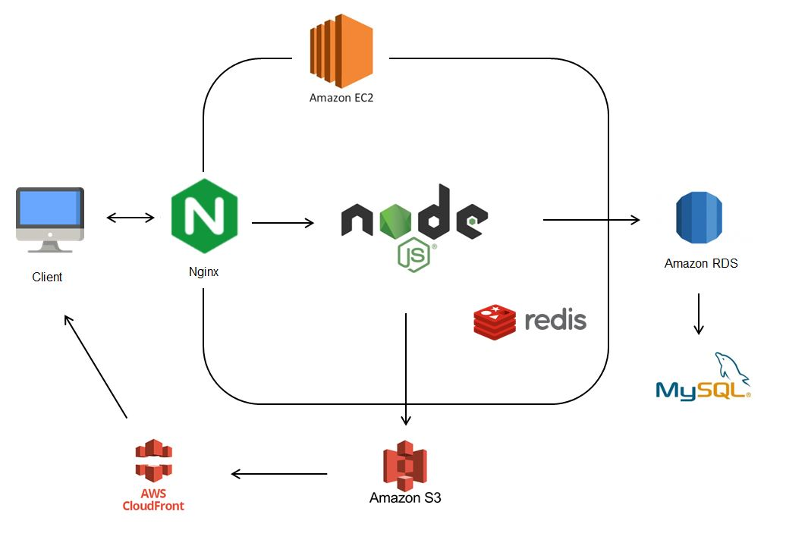
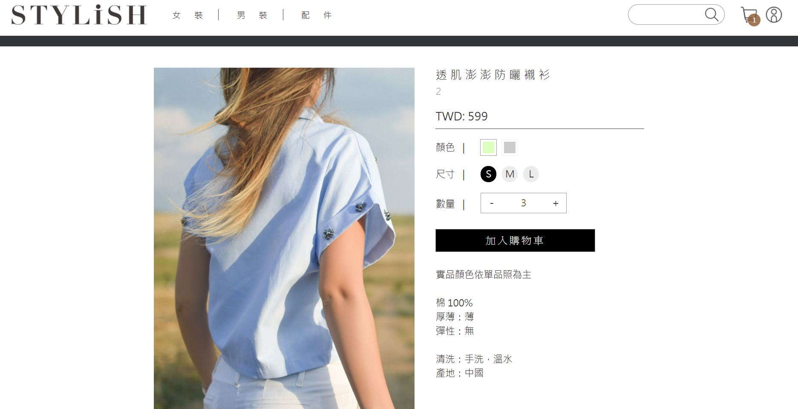
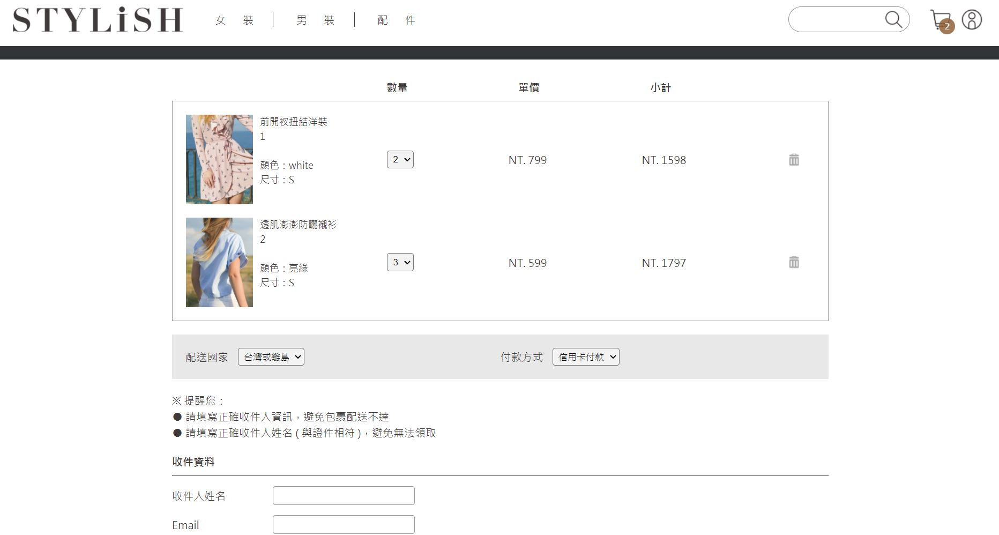

# STYLiSH
An e-commerce website for purchasing clothes and accessories

Website URL : https://stylish.chris-hsiao.site/ (now is temporary closed owing to the fee)

## Table of Contents
* [Technologies](#Technologies)
* [Structure](#structure)
* [Main features](#Main-features)
* [Guest account](#Guest-account)
* [Contact](#Contact)

## Technologies
### Backend
* Node.js
* Express.js
* NGINX
* Redis (cache)
### Front-End
* HTML
* CSS
* JavaScript
### Cloud Service (AWS)
* Compute: EC2
* RDS
* S3
* CDN
### Database
* MySQL
### Third Party API
* Facebook Login
* TapPay SDK

## Structure

## Main features
* View product list and product details
* Choose different color and sizes of products
* Enter shipping and credit card information to check out

## Guest account
* Credit card
    * Card number: 4242424242424242
    * Expiration Date: 01/23
    * Security code: 123

## Contact
* Authur: Ting-Yuan Hsiao
* Email: yuanchris1@gmail.com
